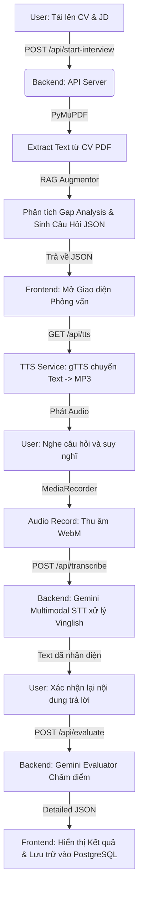

# Hệ thống Phỏng vấn thử bằng Trí Tuệ Nhân Tạo (AI Mock Interviewer)

## 📖 Giới thiệu Dự án
Dự án **AI Mock Interviewer** là một nền tảng toàn diện hỗ trợ ứng viên rèn luyện và chuẩn bị cho các buổi phỏng vấn kỹ thuật từ vị trí Intern đến Senior. Thông qua việc kết hợp cơ sở dữ liệu Vector và sức mạnh của GenAI (Google Gemini), hệ thống mang đến trải nghiệm phỏng vấn mô phỏng sát với thực tế nhất: từ việc sinh câu hỏi cá nhân hoá dựa trên CV & JD, đọc câu hỏi bằng giọng nói, thu âm và nhận diện câu trả lời đa ngôn ngữ (Vinglish - Tiếng Việt pha Tiếng Anh chuyên ngành), cho đến chấm điểm và đưa ra nhận xét chi tiết.
Hệ thống cũng tích hợp chức năng quản trị Admin Dashboard và tính năng Cộng đồng (Community).

---

## 🛠 Những Thư viện & Công nghệ được sử dụng

### 1. Phía Frontend (Ứng dụng Client)
Mã nguồn nằm trong thư mục `frontend/`
- **ReactJS & Vite**: Xây dựng UI thành các Single Page Application (SPA) mượt mà và hiệu suất cao.
- **Tailwind CSS**: Framework tiện lợi cho phép thiết kế giao diện theo sát chuẩn UI/UX hiện đại (gradient, glassmorphism, animation).
- **React Router DOM**: Quản lý định tuyến giữa các trang.
- **Google OAuth (`@react-oauth/google`)**: Tích hợp luồng xác thực bằng tài khoản Google.
- **lucide-react**: Cung cấp các biểu tượng SVG chất lượng cao.
- **Web APIs**: Sử dụng trực tiếp `MediaRecorder API` và `Audio` API trên trình duyệt Web để thu, phát âm thanh.

### 2. Phía Backend (Máy chủ xử lý API & AI)
Mã nguồn nằm trong thư mục `backend/`
- **FastAPI & Uvicorn**: Framework Backend tốc độ cao, xử lý các endpoint bất đồng bộ (async), làm cầu nối giữa React và các dịch vụ AI.
- **Google Generative AI (Gemini 2.5 Flash)**: SDK chính thống tương tác với AI của Google: Vectorize (Embedding) văn bản, Nhận diện tiếng nói từ Audio (Multimodal STT), và Prompt Generative LLM đánh giá/chấm điểm.
- **PostgreSQL**: Cơ sở dữ liệu quan hệ dùng để lưu trữ dữ liệu người dùng, quản lý phiên bản xác thực, lưu trữ lịch sử phỏng vấn, điểm số và câu trả lời.
- **ChromaDB**: Cơ sở dữ liệu Vector cục bộ lưu trữ không gian semantic nhằm tìm nhanh câu hỏi chuyên môn theo ngữ cảnh RAG (Retrieval-Augmented Generation).
- **gTTS (Google Text-to-Speech)**: Dịch vụ chuyển đổi văn bản câu hỏi của AI thành giọng nói trả về cho Frontend.
- **PyMuPDF (fitz)**: Phân tích file PDF, dùng để bóc tách text từ file CV ứng viên.
- **Pydantic**: Quản lý Schema, cấu trúc và kiểm tra tính hợp lệ của dữ liệu đầu vào/đầu ra cho API.

---

## 🚀 Kiến trúc & Luồng hoạt động của Source Code

Toàn bộ hệ thống chạy dựa trên các phân hệ luồng dữ liệu độc lập: **Tiền xử lý Data Pipeline**, **Kiến trúc RAG tối ưu**, và **Luồng Ứng dụng Live (Client-Server)**.

### A. Luồng Tiền xử lý & Nạp Kiến Thức (Data Pipeline)
Thường được chạy tại môi trường local của Developer (trong thư mục `data_pipeline/`):
1. **Xử lý dữ liệu thô**: Đọc dữ liệu CSV (chứa câu hỏi, đáp án, tag kinh nghiệm), làm sạch, gộp metadata và tạo các file JSON chunked được chuẩn hoá.
2. **Nhúng Vector (Embedding - `embed_to_chroma.py`)**: Gửi dữ liệu chunk lên Gemini Embedding API để lấy vector, sau đó lưu toàn bộ vào thư mục ChromaDB cục bộ.

### B. Kiến trúc lõi AI: RAG Pipeline (Retrieve - Augment - Generate)
Nhằm đảm bảo câu hỏi bám sát vào cả kỹ năng và thiếu sót của ứng viên, hệ thống RAG được chia rõ làm 3 bước:
1. **RAG Retriever**: Dựa vào kỹ năng từ CV/JD, truy vấn ChromaDB để tìm các câu hỏi thô sát với chuyên môn.
2. **RAG Augmentor (`rag_augmentor.py`)**: Gọi LLM phân tích điểm chênh lệch (Gap Analysis) giữa CV (ứng viên có gì) và JD (nhà tuyển dụng cần gì). Kết hợp tài liệu thô và Gap Analysis để LLM "Augment" ra các câu hỏi đánh đúng trọng tâm và điểm yếu.
3. **RAG Evaluator/Generator**: Nhận câu trả lời và thông qua LLM để sinh ra điểm số và nhận xét.

### C. Luồng hoạt động Ứng dụng Phỏng Vấn (Live Workflow)

#### 🛠 Chi tiết các giai đoạn thực thi:

#### 1. Giai đoạn Xác thực (Authentication)
Người dùng đăng nhập bằng Email/Password hoặc Google OAuth. Backend tạo phiên làm việc thông qua JWT HTTP-Only Cookies để tăng cường bảo mật.

#### 2. Giai đoạn Thiết lập (Setup Phase)
- Ứng viên tải lên tệp hồ sơ (CV) định dạng PDF và nhập Job Description (JD).
- Giao diện `SetupForm` ở Frontend sẽ gửi tệp lên Backend. `PyMuPDF` giải mã file bytes và lấy toàn bộ text.

#### 3. Khởi tạo Câu Hỏi (Question Generation)
- API endpoint: `/api/start-interview`.
- Áp dụng cấu trúc **RAG Augmentor**, Gemini làm chuyên gia tuyển dụng để phân tích khoảng trống kinh nghiệm (Gap Analysis). Từ đó, trộn lẫn kiến thức ChromaDB để trả ra một mảng JSON các câu hỏi khó/dễ được tinh chỉnh theo chính ứng viên đó.

#### 4. Tương tác Hỏi - Đáp Đa phương thức (Live Interaction)
- **Đọc câu hỏi (TTS):** Khi sang câu hỏi mới, Frontend fetch API `/api/tts`, trả về file audio để phát bằng trình duyệt.
- **Thu âm:** Ứng viên nói, `MediaRecorder API` thu giọng định dạng `.webm`.
- **Nhận diện giọng nói (STT):** Bản thu âm được đẩy lên endpoint `/api/transcribe`. Mô hình **Gemini Multimodal** nghe và bóc tách chữ. Prompt được tùy chỉnh để nhận diện tốt thuật ngữ "Vinglish" (Tiếng Việt kết hợp các từ khóa IT Tiếng Anh).

#### 5. Chấm điểm & Nhận xét Chuyên sâu (Evaluation Phase)
- Hàm `evaluate_service.py` yêu cầu AI đánh giá câu trả lời dựa trên đáp án lý tưởng.
- Kết quả được phân tích chi tiết bằng Pydantic JSON Schema, bao gồm: **Điểm số (0-10), Điểm mạnh, Điểm yếu, và Khuyến nghị học tập**. 
- Dữ liệu hoàn thành này được đẩy lưu trực tiếp vào cơ sở dữ liệu **PostgreSQL** để duy trì lịch sử (Persistent History).

#### 6. Dashboard & Tổng kết
- Sau phỏng vấn, điểm số được tổng hợp vào bảng Lịch sử Phỏng vấn (Interview History). Admin có thể sử dụng giao diện quản trị Admin Dashboard để đánh giá tổng thể người dùng, và người dùng có thể thảo luận tại khu vực Community.
