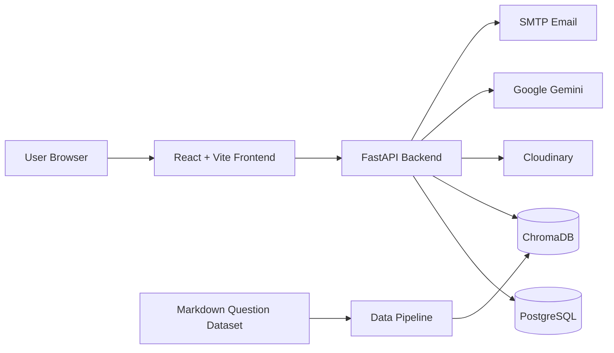
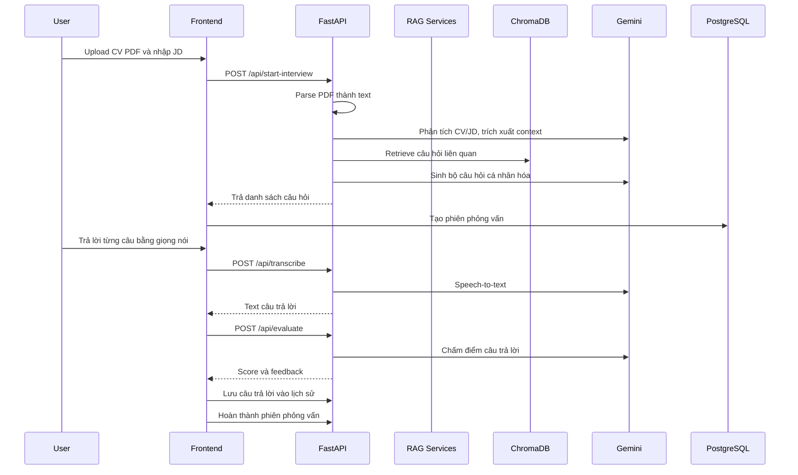
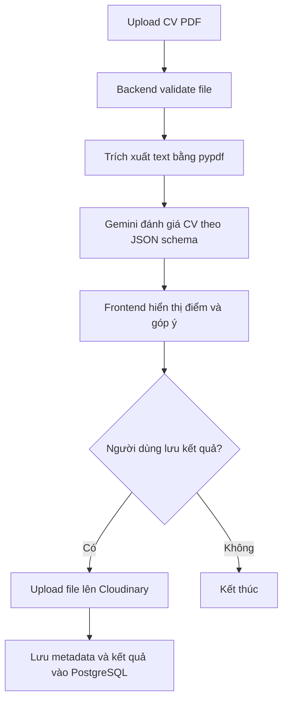
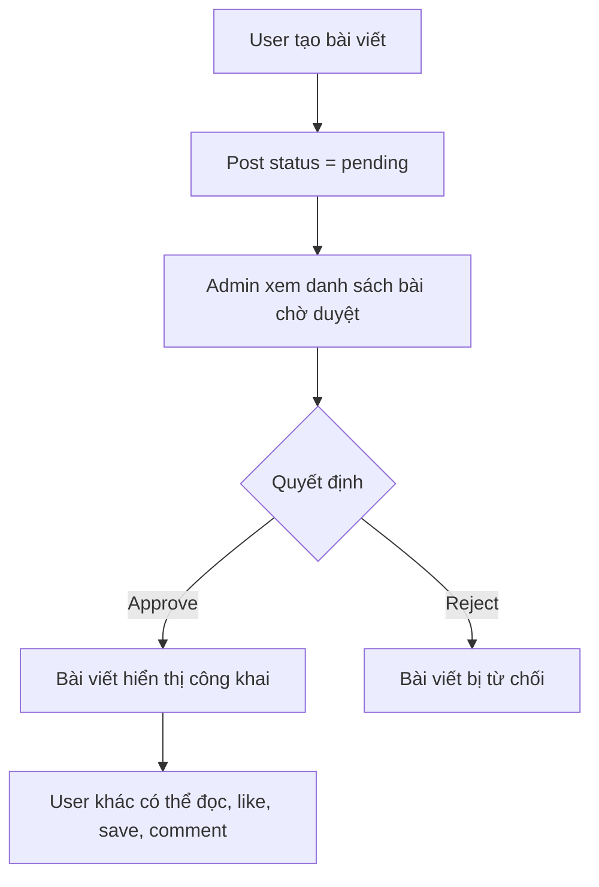

# AI Mock Interviewer

AI Mock Interviewer là nền tảng luyện phỏng vấn kỹ thuật dành cho lập trình viên. Ứng dụng cho phép người dùng tải CV và Job Description, hệ thống dùng RAG kết hợp Google Gemini để sinh bộ câu hỏi cá nhân hóa, hỗ trợ trả lời bằng giọng nói, chấm điểm từng câu và lưu lại lịch sử luyện tập.

Ngoài luồng phỏng vấn giả lập, hệ thống còn có đánh giá CV, luyện tập quiz theo chủ đề, cộng đồng chia sẻ kinh nghiệm và trang quản trị dành cho admin.

## Nội dung chính

- [Chức năng](#chức-năng)
- [Công nghệ sử dụng](#công-nghệ-sử-dụng)
- [Kiến trúc tổng quan](#kiến-trúc-tổng-quan)
- [Luồng hoạt động chính](#luồng-hoạt-động-chính)
- [RAG Pipeline](#rag-pipeline)
- [API chính](#api-chính)
- [Cấu trúc thư mục](#cấu-trúc-thư-mục)
- [Cài đặt và chạy local](#cài-đặt-và-chạy-local)
- [Biến môi trường](#biến-môi-trường)

## Chức năng

### Người dùng

- Đăng ký, đăng nhập bằng email/password.
- Đăng nhập bằng Google OAuth.
- Quên mật khẩu và đặt lại mật khẩu qua email.
- Cập nhật hồ sơ cá nhân.
- Chuyển theme sáng/tối.

### Phỏng vấn AI

- Tải CV dạng PDF và nhập Job Description.
- Chọn cấp độ phỏng vấn và ngôn ngữ.
- Hệ thống phân tích CV/JD, truy xuất ngân hàng câu hỏi từ ChromaDB và sinh câu hỏi phù hợp.
- AI đọc câu hỏi bằng TTS.
- Người dùng trả lời bằng micro hoặc nhập nội dung trả lời.
- Gemini chuyển giọng nói thành văn bản.
- Gemini chấm điểm câu trả lời theo thang 10, trả về điểm mạnh, điểm yếu và gợi ý cải thiện.
- Lưu lịch sử phiên phỏng vấn, từng câu hỏi, câu trả lời, đánh giá và điểm tổng.
- Cho phép hoàn thành, hủy giữa chừng hoặc xóa lịch sử phỏng vấn.

### Đánh giá CV

- Upload CV PDF để AI phân tích.
- Trích xuất nội dung PDF.
- Chấm điểm tổng quan và từng phần trong CV.
- Đưa ra nhận xét và gợi ý cải thiện.
- Lưu lịch sử đánh giá CV vào PostgreSQL.
- Lưu file CV lên Cloudinary.
- Mỗi người dùng có giới hạn số bản đánh giá CV đã lưu.
- Xem chi tiết hoặc xóa bản đánh giá CV.

### Luyện tập theo chủ đề

- Chọn chủ đề, cấp độ, ngôn ngữ và số lượng câu hỏi.
- Lấy câu hỏi từ kho dữ liệu RAG/ChromaDB.
- Tạo session luyện tập.
- Nộp toàn bộ bài để hệ thống chấm điểm và trả đáp án tham khảo.
- Xem lịch sử, thống kê và chi tiết các bài luyện tập.
- Hủy hoặc xóa session luyện tập.

### Cộng đồng

- Xem danh sách bài viết đã được duyệt.
- Tìm kiếm, lọc theo danh mục và tag.
- Tạo bài viết mới, trạng thái mặc định là chờ duyệt.
- Xem chi tiết bài viết và bình luận.
- Like, lưu bài viết, quản lý bài đã lưu.
- Xem bài viết của chính mình, bao gồm pending/rejected.
- Nhận thông báo liên quan đến hoạt động cộng đồng.
- Đánh dấu thông báo đã đọc.

### Quản trị viên

- Xem thống kê tổng quan hệ thống.
- Xem dữ liệu biểu đồ theo thời gian.
- Quản lý người dùng, tạo tài khoản, đổi vai trò, xóa người dùng.
- Xem và xóa lịch sử phỏng vấn.
- Xem top candidates và recent activity.
- Duyệt, từ chối hoặc xóa bài viết cộng đồng.
- Quản lý lịch sử đánh giá CV.
- Kiểm tra trạng thái RAG/ChromaDB.
- Xem audit log các thao tác quản trị.

## Công nghệ sử dụng

### Frontend

- React 19
- Vite 8
- React Router DOM 7
- Tailwind CSS 4
- Lucide React
- Google OAuth client
- Context API cho Auth, Theme và Modal

### Backend

- Python
- FastAPI
- Uvicorn
- Pydantic
- AsyncPG
- PostgreSQL
- python-jose cho JWT
- bcrypt cho mã hóa mật khẩu
- python-multipart cho upload file
- pypdf để đọc CV PDF
- gTTS để tạo audio TTS
- Cloudinary SDK

### AI và dữ liệu

- Google Gemini `gemini-2.5-flash`
- Gemini Embedding `models/gemini-embedding-001`
- ChromaDB persistent vector database
- RAG pipeline cho sinh câu hỏi phỏng vấn và luyện tập
- Dataset câu hỏi kỹ thuật dạng Markdown theo nhiều chủ đề

## Kiến trúc tổng quan



Ứng dụng được chia thành ba phần chính:

- `frontend`: giao diện người dùng, dashboard, admin panel và các luồng tương tác.
- `backend`: REST API, xác thực, nghiệp vụ, gọi LLM, quản lý dữ liệu và upload file.
- `data_pipeline`: xử lý dataset câu hỏi kỹ thuật, chunking, embedding và đồng bộ vào ChromaDB.

PostgreSQL lưu dữ liệu nghiệp vụ như user, interview history, CV evaluation, community, practice session và audit log. ChromaDB lưu vector embedding của ngân hàng câu hỏi để truy xuất ngữ nghĩa khi sinh câu hỏi.

## Luồng hoạt động chính

### Luồng phỏng vấn AI



### Luồng đánh giá CV



### Luồng cộng đồng



## RAG Pipeline

RAG được dùng để tạo câu hỏi phỏng vấn cá nhân hóa và cung cấp câu hỏi luyện tập theo chủ đề.

### 1. Chuẩn bị dữ liệu

- Dataset nằm trong `data_pipeline/dataset`.
- Mỗi file Markdown chứa câu hỏi kỹ thuật theo chủ đề như React, Node.js, Python, Java, SQL, Docker, Git, OOP, Machine Learning, System Design.
- Script trong `data_pipeline/scripts` parse dataset, chunk nội dung và tạo embedding.
- Embedding được lưu vào ChromaDB tại `chroma_db`.

### 2. Trích xuất ngữ cảnh CV/JD

Backend đọc nội dung CV và JD, sau đó dùng Gemini để rút ra:

- Chủ đề kỹ thuật chính.
- Tech stack liên quan.
- Kỹ năng trong CV khớp với JD.
- Khoảng thiếu giữa CV và JD.
- Tóm tắt ứng viên và vị trí ứng tuyển.

### 3. Retrieve

RAG Retriever tạo embedding cho các topic truy vấn bằng Gemini Embedding, rồi truy vấn ChromaDB để lấy các tài liệu/câu hỏi gần nhất theo ngữ nghĩa.

Luồng hiện tại ưu tiên:

- Khoảng 60% câu hỏi cho kỹ năng đã khớp với JD.
- Khoảng 40% câu hỏi cho phần còn thiếu để kiểm tra tiềm năng.
- Lọc theo cấp độ nếu metadata có thông tin level.

### 4. Augment và Generate

RAG Augmentor đưa context CV/JD và raw docs từ ChromaDB vào prompt. Gemini sinh danh sách câu hỏi cuối cùng, kèm reference answer và source để dùng cho chấm điểm.

## API chính

### Auth

- `POST /api/auth/register`: đăng ký tài khoản.
- `POST /api/auth/login`: đăng nhập và set JWT HttpOnly cookie.
- `POST /api/auth/logout`: đăng xuất.
- `GET /api/auth/me`: lấy user hiện tại.
- `PUT /api/auth/profile`: cập nhật profile.
- `POST /api/auth/google/callback`: đăng nhập bằng Google.
- `POST /api/auth/forgot-password`: gửi yêu cầu quên mật khẩu.
- `POST /api/auth/reset-password`: đặt lại mật khẩu.

### Interview

- `POST /api/start-interview`: upload CV/JD và sinh câu hỏi phỏng vấn.
- `POST /api/evaluate`: chấm điểm một câu trả lời.
- `POST /api/transcribe`: chuyển audio sang text.
- `POST /api/tts`: tạo audio đọc câu hỏi.
- `POST /api/interviews`: tạo phiên phỏng vấn.
- `GET /api/interviews`: lấy lịch sử phỏng vấn.
- `GET /api/interviews/{interview_id}`: xem chi tiết phiên phỏng vấn.
- `PATCH /api/interviews/{interview_id}/complete`: hoàn thành phiên.
- `PATCH /api/interviews/{interview_id}/abandon`: hủy phiên.
- `DELETE /api/interviews/{interview_id}`: xóa phiên.

### CV Evaluation

- `POST /api/evaluate/cv`: đánh giá CV.
- `POST /api/evaluate/cv/save`: lưu kết quả đánh giá CV.
- `GET /api/evaluate/cv/count`: đếm số bản đánh giá đã lưu.
- `GET /api/evaluate/cv/history`: danh sách lịch sử đánh giá CV.
- `GET /api/evaluate/cv/history/{evaluation_id}`: chi tiết một bản đánh giá.
- `DELETE /api/evaluate/cv/history/{evaluation_id}`: xóa bản đánh giá.

### Practice

- `GET /api/practice/topics`: danh sách chủ đề luyện tập.
- `POST /api/practice/start`: bắt đầu bài luyện tập.
- `POST /api/practice/sessions/{session_id}/submit`: nộp bài.
- `PATCH /api/practice/sessions/{session_id}/abandon`: hủy bài.
- `GET /api/practice/sessions`: lịch sử luyện tập.
- `GET /api/practice/sessions/{session_id}`: chi tiết bài luyện tập.
- `GET /api/practice/stats`: thống kê luyện tập.
- `DELETE /api/practice/sessions/{session_id}`: xóa bài luyện tập.

### Community

- `GET /api/community/posts`: danh sách bài viết đã duyệt.
- `POST /api/community/posts`: tạo bài viết.
- `GET /api/community/posts/{post_id}`: chi tiết bài viết.
- `DELETE /api/community/posts/{post_id}`: xóa bài viết.
- `POST /api/community/posts/{post_id}/like`: like/unlike bài viết.
- `POST /api/community/posts/{post_id}/save`: save/unsave bài viết.
- `GET /api/community/posts/{post_id}/comments`: lấy bình luận.
- `POST /api/community/posts/{post_id}/comments`: thêm bình luận.
- `DELETE /api/community/comments/{comment_id}`: xóa bình luận.
- `GET /api/community/tags`: tags phổ biến.
- `GET /api/community/my-saves`: bài viết đã lưu.
- `GET /api/community/my-posts`: bài viết của user hiện tại.
- `GET /api/community/notifications`: thông báo.

### Admin

- `GET /api/admin/stats`: thống kê tổng quan.
- `GET /api/admin/stats/chart`: dữ liệu biểu đồ.
- `GET /api/admin/users`: danh sách người dùng.
- `POST /api/admin/users`: tạo người dùng.
- `PATCH /api/admin/users/{user_id}/role`: đổi vai trò.
- `DELETE /api/admin/users/{user_id}`: xóa người dùng.
- `GET /api/admin/interviews`: danh sách toàn bộ phiên phỏng vấn.
- `GET /api/admin/top-candidates`: ứng viên nổi bật.
- `GET /api/admin/recent-activity`: hoạt động gần đây.
- `GET /api/admin/rag/status`: trạng thái RAG.
- `GET /api/admin/community/posts`: quản lý bài viết cộng đồng.
- `PATCH /api/admin/community/posts/{post_id}/approve`: duyệt bài.
- `POST /api/admin/community/posts/{post_id}/reject`: từ chối bài.
- `GET /api/admin/cv-evaluations`: quản lý đánh giá CV.
- `GET /api/admin/audit-logs`: xem audit log.

## Cấu trúc thư mục

```text
C:\DOAN\Data
├── backend/
│   ├── app/
│   │   ├── controllers/       # Điều phối request và gọi service
│   │   ├── core/              # Config, security, dependencies, logging, rate limit
│   │   ├── database/          # Kết nối PostgreSQL
│   │   ├── exceptions/        # Custom errors và exception handlers
│   │   ├── middlewares/       # CORS, logging middleware
│   │   ├── routers/           # REST API routers
│   │   ├── schemas/           # Pydantic schemas
│   │   ├── services/          # Business logic, RAG, AI, auth, community
│   │   └── utils/             # Gemini client, file helpers, datetime helpers
│   ├── database/              # SQL schema và migration scripts
│   ├── tests/                 # Backend tests
│   └── requirements.txt
├── frontend/
│   ├── public/
│   ├── src/
│   │   ├── components/        # UI components dùng chung
│   │   ├── constants/         # Route và API constants
│   │   ├── context/           # Auth, Theme, Modal contexts
│   │   ├── hooks/             # Hooks cho audio, interview, community
│   │   ├── pages/             # Pages user, dashboard, admin
│   │   ├── services/          # API clients
│   │   ├── styles/            # Theme CSS
│   │   └── utils/
│   └── package.json
├── data_pipeline/
│   ├── dataset/               # Dataset Markdown câu hỏi kỹ thuật
│   └── scripts/               # Parse, embed, sync và check RAG data
├── chroma_db/                 # ChromaDB persistent storage
├── uploads/                   # Static uploads local
├── .env.example
└── README.md
```

## Cài đặt và chạy local

### Yêu cầu

- Node.js 18+
- Python 3.10+
- PostgreSQL 14+
- Google Gemini API key
- Google OAuth client ID
- Cloudinary account
- SMTP account nếu dùng quên mật khẩu

### 1. Tạo file môi trường

```powershell
Copy-Item .env.example .env
```

Sau đó cập nhật các giá trị trong `.env`.

### 2. Cài backend

```powershell
cd backend
python -m venv venv
.\venv\Scripts\Activate.ps1
pip install -r requirements.txt
```

### 3. Khởi tạo database

Tạo database PostgreSQL theo `DB_NAME` trong `.env`, sau đó chạy schema:

```powershell
psql -U postgres -d ai_mock_interview_db -f database/schema.sql
```

Nếu cần chạy migration riêng lẻ, xem các file trong `backend/database`.

### 4. Khởi tạo dữ liệu RAG

Chạy embedding dataset vào ChromaDB:

```powershell
cd ..\data_pipeline\scripts
python embed_all_datasets.py
```

Có thể kiểm tra trạng thái RAG:

```powershell
python check_rag_status.py
```

### 5. Chạy backend

Từ thư mục `backend`:

```powershell
uvicorn app.main:app --reload --port 8000
```

Backend chạy tại:

```text
http://localhost:8000
```

Swagger UI:

```text
http://localhost:8000/docs
```

### 6. Cài và chạy frontend

```powershell
cd frontend
npm install
npm run dev
```

Frontend mặc định chạy tại:

```text
http://localhost:5173
```

## Biến môi trường

Các biến chính nằm trong `.env.example`:

```env
GOOGLE_API_KEY=
GOOGLE_API_KEY_EMBEDDING=
GOOGLE_API_KEY_TRANSLATE=
GOOGLE_API_KEY_EXTRACT_TOPIC=
GOOGLE_API_KEY_GENERATE_Q=
GOOGLE_API_KEY_EVALUATE=

DB_HOST=localhost
DB_PORT=5432
DB_USER=postgres
DB_PASSWORD=
DB_NAME=ai_mock_interview_db

JWT_SECRET_KEY=
COOKIE_SECURE=false

GOOGLE_CLIENT_ID=
VITE_GOOGLE_CLIENT_ID=

CLOUDINARY_CLOUD_NAME=
CLOUDINARY_API_KEY=
CLOUDINARY_API_SECRET=

SMTP_HOST=
SMTP_PORT=587
SMTP_USERNAME=
SMTP_PASSWORD=
SMTP_FROM_EMAIL=
SMTP_USE_TLS=true

VITE_API_BASE_URL=http://localhost:8000/api
```

## Scripts hữu ích

### Frontend

```powershell
npm run dev
npm run build
npm run lint
npm run preview
```

### Backend

```powershell
uvicorn app.main:app --reload --port 8000
```

### Data pipeline

```powershell
python parse_datasets.py
python embed_all_datasets.py
python check_rag_status.py
python sync_chroma_metadata.py
```

## Kiểm thử

Backend có thư mục `backend/tests`. Có thể cài thêm dependency dev và chạy test từ thư mục `backend`:

```powershell
pip install -r requirements-dev.txt
pytest
```

Frontend có thể kiểm tra lint:

```powershell
cd frontend
npm run lint
```

## Ghi chú triển khai

- File CV upload cho phỏng vấn và đánh giá CV chỉ hỗ trợ PDF.
- Giới hạn upload CV hiện tại là 10MB.
- Upload ảnh cộng đồng/profile hỗ trợ JPEG, PNG, WEBP và GIF, giới hạn 5MB.
- JWT được lưu trong HttpOnly cookie.
- Một số endpoint có rate limit để tránh gọi LLM quá dày.
- Nếu ChromaDB chưa có dữ liệu, luồng RAG sẽ không truy xuất được câu hỏi chất lượng.
- Nếu thiếu Gemini API key hoặc gặp lỗi quota/rate limit, các chức năng AI sẽ thất bại hoặc trả fallback.
