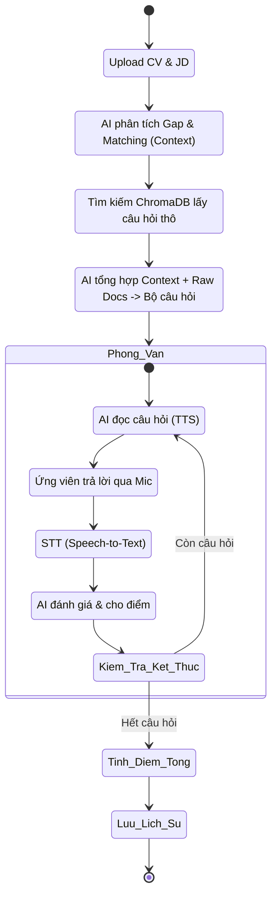
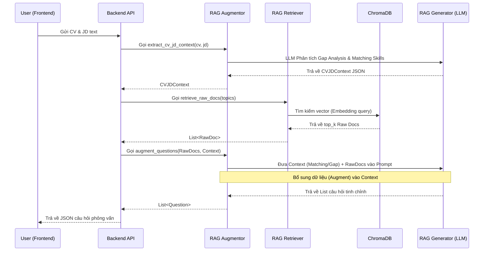
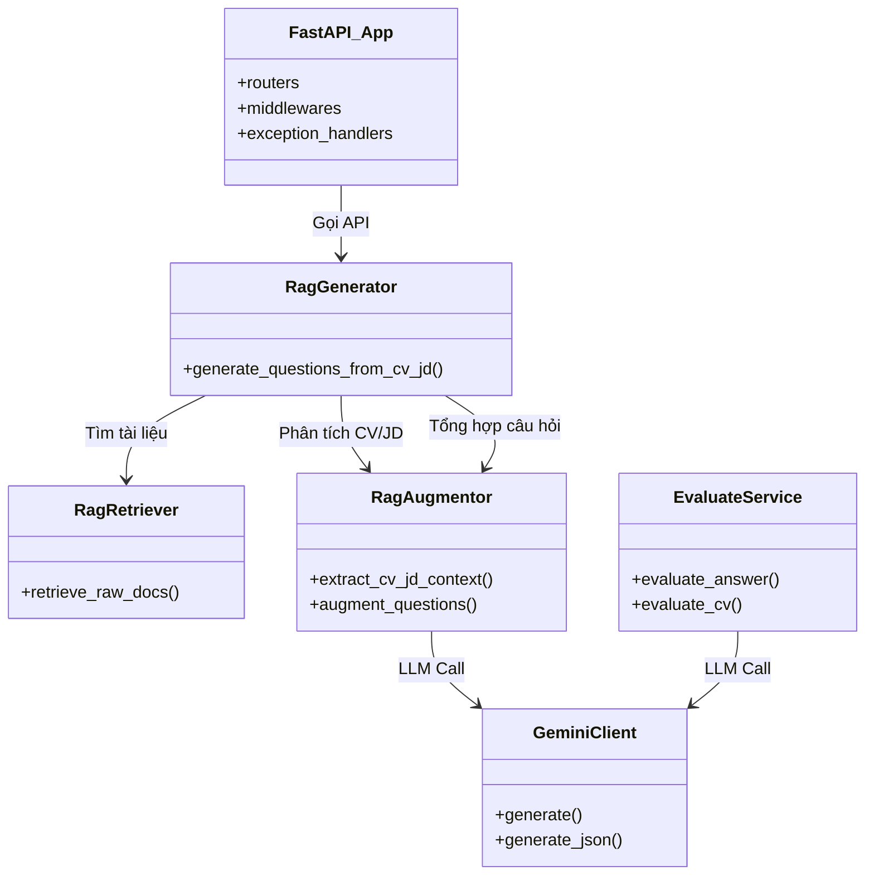

# AI Mock Interviewer

Hệ thống **AI Mock Interviewer** là một nền tảng phỏng vấn giả lập thông minh dành cho developer. Hệ thống tự động phân tích CV của ứng viên và đối chiếu với Job Description (JD) để tạo ra bộ câu hỏi cá nhân hóa. Với sức mạnh của hệ thống RAG (Retrieval-Augmented Generation) kết hợp cùng Google Gemini, ứng viên có thể trải nghiệm quá trình hỏi đáp bằng giọng nói theo thời gian thực và nhận được những đánh giá, góp ý sát thực tế.

## 1. Công nghệ sử dụng
- **Frontend**: React.js, Vite, TailwindCSS (glassmorphism UI), Lucide React.
- **Backend**: FastAPI, Python 3.10+, PostgreSQL (lưu trữ người dùng, lịch sử, cộng đồng), ChromaDB (Vector Database).
- **AI / LLM**: Google Gemini (gemini-2.5-flash) cho cả sinh câu hỏi và đánh giá. Mô hình nhúng (Embedding) sử dụng `gemini-embedding-001`.
- **Media / Storage**: Cloudinary (lưu file CV PDF và Avatar).

---

## 2. Các Tác nhân (Actors) trong Hệ thống

1. **Ứng viên (User)**: Người dùng chính của hệ thống. Họ tải CV, JD lên để phỏng vấn, xem lại kết quả đánh giá (CV History, Interview History) và tham gia giao lưu trên Cộng đồng.
2. **Quản trị viên (Admin)**: Quản lý người dùng, kiểm duyệt bài viết trên Cộng đồng, theo dõi các chỉ số và dữ liệu hệ thống.
3. **AI (Gemini) + RAG Pipeline**: Đóng vai trò là "Người phỏng vấn" - sinh câu hỏi chuyên môn dựa trên CV/JD, phân tích giọng nói (STT), tổng hợp giọng nói (TTS), và chấm điểm (Evaluate).

---

## 3. Sơ đồ Use Case (Use Case Diagram)

```mermaid
usecaseDiagram
    actor "Ứng viên (User)" as U
    actor "Quản trị viên (Admin)" as A
    actor "AI & RAG System" as AI

    package "AI Mock Interview System" {
        U --> (Đăng ký & Đăng nhập)
        U --> (Phỏng vấn thử)
        U --> (Đánh giá CV)
        U --> (Quản lý Lịch sử)
        U --> (Đăng bài Cộng đồng)
        
        A --> (Kiểm duyệt Bài viết)
        A --> (Quản lý Người dùng)
        
        (Phỏng vấn thử) ..> (Sinh câu hỏi phỏng vấn) : <<include>>
        (Phỏng vấn thử) ..> (Chấm điểm & Đánh giá) : <<include>>
        
        AI --> (Sinh câu hỏi phỏng vấn)
        AI --> (Chấm điểm & Đánh giá)
        AI --> (Đánh giá CV)
    }
```

### Đặc tả các Use Case chính:
- **UC01 - Đăng nhập/Đăng ký**: Hỗ trợ đăng ký truyền thống (Email/Password) kết hợp xác thực qua Google OAuth2.
- **UC02 - Phỏng vấn thử (Mock Interview)**: Upload CV/JD, thiết lập cấp độ và ngôn ngữ. Hệ thống dùng RAG để tạo câu hỏi. Ứng viên tương tác bằng giọng nói. AI chấm điểm từng câu.
- **UC03 - Đánh giá CV (CV Evaluation)**: Upload file PDF. LLM phân tích bố cục, kinh nghiệm, kỹ năng và đưa ra gợi ý tối ưu. Lưu lịch sử tối đa 2 bản.
- **UC04 - Cộng đồng (Community)**: Chia sẻ kinh nghiệm, đăng bài hỏi đáp. Bài viết phải qua bước kiểm duyệt của Admin trước khi hiển thị công khai.

---

## 4. Sơ đồ Hoạt động (Activity Diagram) - Luồng Phỏng vấn



---

## 5. Sơ đồ Tuần tự (Sequence Diagram) - RAG Pipeline



---

## 6. Sơ đồ Lớp (Class Diagram) - Backend Kiến trúc



---

## 7. Kiến trúc RAG chi tiết (Retrieval-Augmented Generation)

Hệ thống xử lý bài toán sinh câu hỏi dựa trên CV của ứng viên bằng cách áp dụng RAG với 3 giai đoạn rõ rệt, tính toán dữ liệu bằng các thuật toán NLP và Vector Search:

### 7.1 Data Pipeline (Tiền xử lý)
- **Thuật toán xử lý**: Markdown text slicing. Hệ thống đọc các file markdown (`dataset/`), chia nhỏ (chunking) theo cú pháp (hỏi đáp).
- **Embedding**: Sử dụng `gemini-embedding-001` để biến chuỗi văn bản thành vector đa chiều. Vector này mang ý nghĩa ngữ nghĩa (semantic meaning).
- **Lưu trữ**: Vector cùng siêu dữ liệu (metadata như cấp độ, công nghệ) được đưa vào **ChromaDB**.

### 7.2 Retrieve (Truy xuất dữ liệu)
- **Hoạt động**: Khi có CV và JD, thuật toán trích xuất từ khóa tìm kiếm (Query Topics). Hệ thống đưa query qua model nhúng để thành vector.
- **Thuật toán**: Sử dụng **Cosine Similarity** (hoặc L2 Distance) trong ChromaDB để tìm top 20 tài liệu gần nhất (Nearest Neighbors) với vector truy vấn.
- **Kết quả**: Ngân hàng câu hỏi thô (Raw Docs).

### 7.3 Augment (Bổ sung dữ liệu ngữ cảnh)
- **Hoạt động**: Đây là bước cốt lõi tạo nên tính "cá nhân hóa". 
- Hệ thống áp dụng **Gap Analysis**: So khớp (Matching) giữa những kỹ năng JD cần và CV đang có. Tìm ra khoảng hở (Gap) - kỹ năng JD cần nhưng CV thiếu.
- **Prompt Engineering**: Raw docs từ bước Retrieve được nối (concatenate) cùng với kết quả Gap Analysis tạo thành một **Context dồi dào và chặt chẽ**.
- Đây chính là phần bổ sung dữ liệu vào prompt/context trước khi đưa cho LLM.

### 7.4 Generate (LLM Sinh câu hỏi)
- **Hoạt động**: Đưa Prompt đã được *Augment* vào LLM (`gemini-2.5-flash`).
- Đây là phần sử dụng sức mạnh của LLM để sinh ra các câu hỏi phỏng vấn mạch lạc, thực tế.
- **Thuật toán / Quy tắc ép kiểu**: Yêu cầu LLM sinh ra chính xác JSON Schema định sẵn. 
- LLM được thiết lập với bộ hướng dẫn khắt khe: 60% câu hỏi đào sâu vào kỹ năng đã khớp (Matching) để kiểm chứng, 40% câu hỏi khai thác khoảng hở (Gap) để đánh giá tiềm năng. Kết quả cuối cùng là bộ câu hỏi chất lượng cao gửi về Frontend.

---

## 8. Cấu trúc thư mục

```text
c:\DOAN\Data\
├── backend/                  # Mã nguồn FastAPI
│   ├── app/
│   │   ├── controllers/      # Xử lý logic API (Auth, Interview, Community,...)
│   │   ├── services/         # Chứa RagGenerator, RagRetriever, RagAugmentor, ...
│   │   ├── database/         # Kết nối PostgreSQL, schema
│   │   ├── core/             # Cấu hình, bảo mật, logger
│   │   └── utils/            # Helper function (GeminiClient, file_upload)
│   └── main.py               # Entrypoint FastAPI
├── frontend/                 # Mã nguồn React.js
│   ├── src/
│   │   ├── components/       # Các module UI tái sử dụng (Toast, ScoreBar, ...)
│   │   ├── pages/            # View logic (Dashboard, History, Community, ...)
│   │   ├── services/         # Gọi HTTP Request tới Backend
│   │   ├── context/          # Quản lý State toàn cục (AuthContext)
│   │   └── styles/           # Global CSS, Theme Variables
│   └── index.html
├── data_pipeline/            # Tập lệnh xử lý dữ liệu RAG
│   ├── dataset/              # Chứa các file Markdown kiến thức lập trình
│   └── scripts/              # Chứa script embedding và đẩy data lên ChromaDB
└── README.md                 # Tài liệu mô tả hệ thống
```

---

## 9. Hướng dẫn cài đặt và chạy hệ thống

### 9.1 Yêu cầu môi trường
- Node.js >= 18
- Python >= 3.10
- PostgreSQL >= 14
- Tài khoản Google Gemini API Key
- Tài khoản Cloudinary

### 9.2 Khởi chạy Backend
```bash
cd backend
python -m venv venv
source venv/bin/activate  # Hoặc venv\Scripts\activate trên Windows
pip install -r requirements.txt
uvicorn app.main:app --reload --port 8000
```

### 9.3 Khởi chạy Frontend
```bash
cd frontend
npm install
npm run dev
```

### 9.4 Khởi tạo dữ liệu (Lần đầu tiên)
1. Đảm bảo cấu hình đúng chuỗi kết nối Database trong file `.env`.
2. Chạy schema SQL để tạo bảng (`backend/database/schema.sql`).
3. (Tùy chọn) Chạy script RAG data pipeline:
```bash
cd data_pipeline/scripts
python embed_all_datasets.py
```
