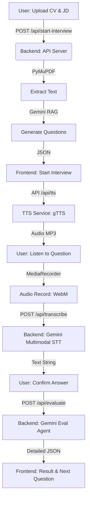

# AI Mock Interviewer System

Dự án Hệ thống phỏng vấn thử bằng Trí Tuệ Nhân Tạo (AI Mock Interviewer) là một ứng dụng toàn diện giúp người dùng luyện tập kỹ năng phỏng vấn kỹ thuật từ Intern tới Senior. Thông qua dữ liệu được nạp vào cơ sở dữ liệu Vector và sự kết hợp của GenAI (Google Gemini), hệ thống có thể đóng vai trò như một Interviewer ảo: chọn lọc câu hỏi, đọc câu hỏi bằng giọng nói, thu âm nhận diện câu trả lời kết hợp cả Tiếng Anh và Tiếng Việt (Vinglish), và cuối cùng là chấm điểm kèm nhận xét chi tiết.

---

## 🛠 Những Thư viện / Công nghệ được sử dụng

### 1. Phía Frontend (Ứng dụng Client)
Nằm trong thư mục `backend/`
- **ReactJS & Vite**: Giúp xây dựng UI thành các Component modular chạy nhanh.
- **Tailwind CSS**: Framework tiện lợi cho phép thiết kế giao diện theo sát chuẩn UI/UX hiện đại (gradient, animation).
- **lucide-react**: Thư viện chứa các Icon SVG sử dụng trong ứng dụng.
- Sử dụng trực tiếp `MediaRecorder API` và `Audio` API trên trình duyệt Web để thu phát âm thanh.

### 2. Phía Backend (Máy chủ xử lý AI)
Nằm trong thư mục `frontend/`
- **FastAPI** & **Uvicorn**: Máy chủ Backend với hiệu năng truy xuất cao để dễ đóng mở luồng API nhanh chóng giữa React và GenAI.
- **google-generativeai**: SDK chính thống tương tác với hệ thống AI của Google, sử dụng để: Vectorize (Embedding) văn bản, Transcribe Multi-modal nhận diện tiếng nói, và Chat Generative LLM đánh giá / dịch thuật ngữ AI.
- **chromadb**: Cơ sở dữ liệu vec-tơ lưu trữ không gian semantic nhằm tìm nhanh câu trả lời theo ngữ cảnh RAG (Retrieval-Augmented Generation).
- **gTTS** (Google Text-to-Speech): Chuyển văn bản câu hỏi thành Giọng đọc AI trả về cho Frontend phát.
- **pydantic**, **python-dotenv**: Giúp quản lý schema validation API và load nhanh các biến bảo mật từ file hệ thống `.env`.

---

## 🚀 Logic chạy & Luồng hoạt động của Source Code

Toàn bộ hệ thống chạy dựa trên hai luồng chia tách rõ ràng: **Tiền xử lý Data** và **Application Hoạt động thời gian thực**.

### A. Luồng Tiền xử lý & Nạp Kiến Thức chuẩn bị (Data Pipeline)
Được chạy dưới local terminal nội bộ bởi Dev với các file trực tiếp tại gốc nhằm chuẩn bị dữ liệu phỏng vấn:

1. **Xử lý thô (`process_sample.py`)**: Script này đọc dữ liệu CSV thô từ `sample.csv` (chứa input, answer, question origin). Làm sạch, gộp metadata (loại chủ đề, kinh nghiệm level) và dump ra một file JSON được chuẩn hoá gọi là `chunked_sample.json`.
2. **Nhúng Vector Nâng Cao (`embed_to_chroma.py`)**: Đọc từng chunk file `chunked_sample.json` và yêu cầu Gemini Embedding API biểu thị chúng dưới dạng Vec-tơ số học. Sau đó lưu tất cả khối lượng lớn này vào một local DB là thư mục `chroma_db/`. (Quá trình này có tính năng tự động delay exponential mỗi khi hit threshold của Google rate limit API).
3. **Kiểm tra trạng thái (`check_chroma.py`)**: Load thử xem thư mục local DB đắp xong chưa, test thử quá trình tìm kiếm với top K xem điểm số tương đương cao nhất. Log nằm tại `check_result.txt`.

### B. Luồng hoạt động Ứng dụng AI Phỏng Vấn (Live App Workflow)

Hệ thống hoạt động theo mô hình Client-Server hiện đại, kết hợp chặt chẽ giữa khả năng xử lý giao diện của React và khả năng xử lý AI đa phương thức của FastAPI.

#### 🛠 Chi tiết các giai đoạn hoạt động:

#### 1. Giai đoạn thiết lập & Phân tích (Setup Phase)
- **Nhiệm vụ:** Thu thập hồ sơ ứng viên (CV) và yêu cầu công việc (JD).
- **Công nghệ/Thư viện:** 
    - **Frontend:** `SetupForm.jsx` sử dụng HTML5 File Input và Hooks để quản lý trạng thái.
    - **Backend:** `pdf_parser.py` sử dụng thư viện **PyMuPDF (fitz)** để xử lý file PDF bytes thành văn bản thô.
- **Cơ chế:** Backend nhận file và văn bản từ Form Data, trích xuất thông tin CV và chuẩn hóa nội dung JD trước khi chuyển sang bước tạo câu hỏi.

#### 2. Khởi tạo buổi phỏng vấn (Question Generation)
- **Nhiệm vụ:** Tạo danh sách câu hỏi phỏng vấn được cá nhân hóa hoàn toàn.
- **Công nghệ/Thư viện:**
    - **API Endpoint:** `/api/start-interview`.
    - **Mô hình AI:** **Google Gemini 2.5 Flash**.
- **Cơ chế:** Sử dụng kỹ thuật **System Prompting** để định danh Gemini làm chuyên gia tuyển dụng. AI dựa trên nội dung CV/JD để suy luận ra các câu hỏi kỹ thuật phù hợp với Level (Intern, Junior, Senior). Kết quả trả về là một danh sách JSON gồm nội dung câu hỏi và đáp án tham khảo lý tưởng.

#### 3. Tương tác Hỏi - Đáp Đa phương thức (Live Interaction)
- **Nhiệm vụ:** Giả lập môi trường phỏng vấn thực tế bằng giọng nói (STT & TTS).
- **Công nghệ/Thư viện:**
    - **Chuyển văn bản thành tiếng (TTS):** Sử dụng **gTTS** (Google Text-to-Speech) để tạo giọng đọc tự nhiên.
    - **Thu âm (Frontend):** Sử dụng **MediaRecorder API** ghi âm định dạng `audio/webm;codecs=opus`.
    - **Nhận diện giọng nói (STT):** Endpoint `/api/transcribe` gửi audio trực tiếp sang **Gemini Multimodal**.
- **Cơ chế:** Gemini xử lý audio đầu vào với khả năng nhận diện thuật ngữ **Vinglish** (tiếng Việt pha tiếng Anh chuyên ngành) cực tốt nhờ bộ Prompt được tối ưu hóa, đảm bảo trích xuất nội dung trả lời chính xác nhất.

#### 4. Chấm điểm & Nhận xét Chuyên sâu (Evaluation Phase)
- **Nhiệm vụ:** Đánh giá chuyên môn và cung cấp phản hồi cho ứng viên.
- **Công nghệ/Thư viện:**
    - **Logic xử lý:** `rag_service.py` -> `evaluate_rag_answer`.
    - **Định dạng dữ liệu:** Sử dụng **Pydantic Models** và **Gemini JSON Mode**.
- **Cơ chế:** AI thực hiện so khớp ngữ nghĩa giữa câu trả lời của thí sinh và đáp án tham khảo. Hệ thống bóc tách kết quả thành các trường: Score (0-10), Strong Points, Weak Points, và Study Recommendations.

#### 5. Kết luận & Tổng hợp (Final Assessment)
- **Nhiệm vụ:** Tổng kết hiệu suất buổi phỏng vấn.
- **Công nghệ/Thư viện:** UI Components hiện đại với CSS Animation và Lucide Icons.
- **Cơ chế:** Sau khi hoàn thành bộ câu hỏi, hệ thống tổng hợp lịch sử chấm điểm, tính toán điểm trung bình và đưa ra nhận định liệu ứng viên đã sẵn sàng cho buổi phỏng vấn thực tế hay chưa.

*(Lưu ý: Bạn cũng có một file `rag_interview_test.py` cung cấp chức năng CLI Mock Test để test Terminal thay vì chạy UI Graphic nếu backend muốn kiểm thử luồng nhanh chóng)*
